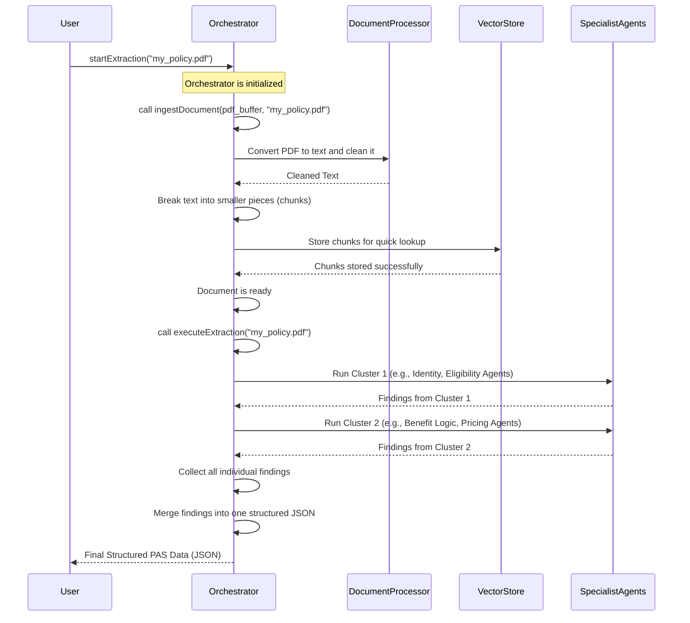

# Chapter 1: Agent Orchestrator

Imagine you have a big, complex policy document – maybe hundreds of pages long – and you need to find specific pieces of information, like who is eligible for coverage, what benefits are included, or how much it costs. Doing this manually for many documents would take a very long time and be prone to errors!

This is where the **Agent Orchestrator** comes in. Think of it as the ultimate project manager or the control tower for extracting all the important details from these documents. Its main job is to take a raw PDF policy document and, using a team of smart "specialist agents," turn it into a perfectly organized, structured report (a JSON file) that a computer system can easily understand and use.

## What is the Agent Orchestrator?

The Agent Orchestrator is the brain behind the entire policy extraction process. It doesn't do all the work itself, but it knows *how* to get the work done by coordinating a team of specialized AI agents.

Here's an analogy: Imagine you're building a house. You don't do everything yourself. You hire a project manager.
*   The project manager (Orchestrator) receives the architectural plans (your PDF policy).
*   They then coordinate different specialists: a plumber, an electrician, a carpenter (our "specialist agents").
*   They make sure these specialists don't all work in the same spot at the same time, causing chaos (managing API load).
*   Finally, they collect all the work from the specialists and combine it into a finished house (our structured JSON report).

## How the Orchestrator Solves the Problem

The Agent Orchestrator handles several crucial tasks to ensure the smooth and efficient extraction of information:

1.  **Receives the Raw Document**: It takes the original PDF file as its starting point.
2.  **Prepares for AI**: It cleans up the document and breaks it into smaller, manageable pieces (called "chunks") that are easier for AI to process. We'll dive deeper into this in [Chapter 2: Document Ingestion & Semantic Chunking](02_document_ingestion___semantic_chunking_.md).
3.  **Manages "Specialist Agents"**: It has a roster of dedicated AI agents, each an expert in a specific area (e.g., an "Identity Agent" for policy names, an "Eligibility Agent" for who's covered). We'll meet these agents in [Chapter 5: Specialist Agents](05_specialist_agents_.md).
4.  **Coordinates Work (Clustering)**: Instead of letting all specialist agents run wild at once (which can overwhelm the system), the Orchestrator groups them into small "clusters." It then runs one cluster at a time, making the process more stable and efficient.
5.  **Gathers Findings**: Once each specialist agent finishes its part, the Orchestrator collects all their individual findings.
6.  **Puts it All Together**: It then merges all these separate pieces into one complete, well-organized JSON report, following a predefined structure called the [Definitive PAS Schema](06_definitive_pas_schema_.md).

## Putting the Orchestrator to Work: A Simple Use Case

Let's look at how you might tell the Orchestrator to extract information from a PDF policy document. From a high level, it's a two-step process: first, prepare the document, then extract the data.

Here's a simplified example of how you might use the `AgentOrchestrator` in a web application:

```typescript
// app/api/extract/route.ts (Simplified)
import { AgentOrchestrator } from "@/lib/agents/orchestrator";
import { NextRequest, NextResponse } from "next/server";

export async function POST(req: NextRequest) {
    // Imagine we've received a PDF file from a user
    const formData = await req.formData();
    const file = formData.get("file") as File;
    const buffer = Buffer.from(await file.arrayBuffer());
    const fileName = file.name;

    // 1. Create our Orchestrator
    const orchestrator = new AgentOrchestrator();

    // 2. Tell the Orchestrator to prepare the document for AI processing
    console.log(`Ingesting document: ${fileName}`);
    const ingestResult = await orchestrator.ingestDocument(buffer, fileName);

    // 3. Tell the Orchestrator to execute the extraction process
    console.log(`Executing agents for: ${fileName}`);
    const extractionResults = await orchestrator.executeExtraction(fileName);

    // The Orchestrator returns the final structured report!
    return NextResponse.json({ success: true, extraction: extractionResults });
}
```
**What's Happening Above?**

1.  We first get the policy PDF file (as a `buffer` and `fileName`).
2.  We create an instance of our `AgentOrchestrator`. This is like hiring our project manager.
3.  We call `orchestrator.ingestDocument()`. This tells the Orchestrator: "Here's the raw PDF, please get it ready for our AI team." The output (`ingestResult`) will tell us how many pieces (chunks) were created.
4.  Then, we call `orchestrator.executeExtraction()`. This tells the Orchestrator: "Now that the document is prepared, please coordinate your specialist agents to extract all the necessary information."
5.  The `extractionResults` will be a beautifully structured JSON object containing all the policy details.

**Example Input (Conceptual):**

Imagine a PDF file named `my_policy.pdf` containing the details of an insurance policy.

**Example Output (Conceptual):**

After the Orchestrator finishes, you'd get a JSON output like this:

```json
{
  "success": true,
  "extraction": {
    "policy_identification": {
      "policy_name": "Health Shield Plan",
      "policy_number": "HS-123456",
      "effective_date": "2023-01-01"
    },
    "eligibility_rules": {
      "age_min": 18,
      "age_max": 65,
      "enrollment_period": "Annual"
    },
    "benefits": {
      "doctor_visits": { "coverage": "80%", "deductible": 500 },
      "hospitalization": { "coverage": "90%", "deductible": 1000 }
    }
    // ... many more structured details ...
  }
}
```
This structured JSON is incredibly useful because computer systems can easily read and process it, unlike a raw PDF!

## Behind the Scenes: How the Orchestrator Works Internally

Let's peek under the hood to see the steps the `AgentOrchestrator` takes when you tell it to do its job.

The Orchestrator acts like a conductor for an orchestra of specialist agents. Here's a simplified flow:



Now let's look at some key parts of the `AgentOrchestrator` code.

### 1. Setting Up the Team (Constructor)

When the `AgentOrchestrator` is created, it immediately assembles its team of specialist agents.

```typescript
// lib/agents/orchestrator.ts (Simplified)
import { IdentityAgent } from "./identity-agent";
import { EligibilityAgent } from "./eligibility-agent";
// ... other agent imports ...

export class AgentOrchestrator {
    private agents: BaseAgent[] = [];

    constructor() {
        // The orchestrator knows which expert agents it needs
        this.agents = [
            new IdentityAgent(),      // Finds policy identification details
            new EligibilityAgent(),   // Checks who can be covered by the policy
            // ... many other specialist agents are initialized here ...
        ];
    }
    // ... rest of the class ...
}
```
**Explanation:** This part is like our project manager knowing exactly which experts (agents) they have on their team for different tasks. Each `new ...Agent()` creates an instance of a specialist ready to work.

### 2. Getting the Document Ready (`ingestDocument`)

This method is responsible for taking the raw PDF and preparing it for AI processing.

```typescript
// lib/agents/orchestrator.ts (Simplified)
import { addDocumentSections } from "../vector-store"; // Used for linking purposes
import { logger } from "../utils"; // Used for logging

public async ingestDocument(buffer: Buffer, fileName: string) {
    // 1. Read the PDF document (uses an external tool)
    const pdfData = await require("pdf-parse')(buffer);
    let text = pdfData.text || "";

    // 2. Clean up the text (remove strange, non-printable characters)
    text = text.replace(/\u0000/g, "");

    // 3. Break the document into small, understandable pieces (chunks)
    //    This helps our AI agents focus on specific parts without getting overwhelmed.
    const chunks = this.semanticChunk(text); // More on this in [Chapter 2](02_document_ingestion___semantic_chunking_.md)

    // 4. Store these pieces in a special database for quick searching
    //    Our specialist agents will use this to find relevant information quickly.
    await addDocumentSections(chunks.map(content => ({ content, metadata: { source: fileName } })));
    logger.info(`Ingestion complete: ${chunks.length} chunks created for ${fileName}`);
    return { message: "Document prepared!", chunksCreated: chunks.length };
}
```
**Explanation:** This is the "preparation phase." First, it converts the PDF into plain text. Then, it cleans the text. Crucially, it then breaks the long text into smaller, context-rich "chunks" using `semanticChunk` (which we'll explore in [Chapter 2: Document Ingestion & Semantic Chunking](02_document_ingestion___semantic_chunking_.md)). Finally, these chunks are stored in a special database (a [Vector Store (Supabase + pgvector)](03_vector_store__supabase___pgvector__.md)) so agents can quickly find information.

### 3. Orchestrating the Extraction (`executeExtraction`)

This is where the Orchestrator truly shines, running the specialist agents and consolidating their findings.

```typescript
// lib/agents/orchestrator.ts (Simplified)
import { DEFINITIVE_PAS_SCHEMA } from "./schema"; // Used for linking purposes
import { logger } from "../utils"; // Used for logging

public async executeExtraction(documentId: string): Promise<any> {
    logger.info(`[ORCHESTRATOR] Starting definitive PAS extraction for: ${documentId}`);
    const results: AgentResponse[] = [];
    const clusterSize = 2; // We run 2 agents at a time to be efficient

    // Run agents in small groups (clusters) to avoid hitting limits
    // and process the document more efficiently.
    for (let i = 0; i < this.agents.length; i += clusterSize) {
        const cluster = this.agents.slice(i, i + clusterSize);
        logger.debug(`[ORCHESTRATOR] Executing agent cluster: ${cluster.map(a => a.name).join(", ")}`);
        // Each agent in the cluster works on its task in parallel
        const clusterResults = await Promise.all(cluster.map(agent => agent.run(documentId)));
        results.push(...clusterResults);
    }

    // Start with an empty structured report (defined in [Chapter 6](06_definitive_pas_schema_.md))
    const consolidatedData: any = JSON.parse(JSON.stringify(DEFINITIVE_PAS_SCHEMA));

    // Combine all the findings from different agents into one final report
    results.forEach(res => {
        if (res.status === "success" && res.data) {
            this.deepMerge(consolidatedData, res.data);
        }
    });

    return consolidatedData;
}
```
**Explanation:** This method coordinates the actual information extraction. It loops through the list of [Specialist Agents](05_specialist_agents_.md), but instead of running them all at once, it groups them into `clusterSize` (e.g., 2) and waits for each cluster to finish. This is crucial for managing API requests to AI models and preventing errors. Once all agents have provided their `results`, the Orchestrator takes an empty structure based on the [Definitive PAS Schema](06_definitive_pas_schema_.md) and uses `deepMerge` to combine all the findings into a single, comprehensive report.

### 4. Smart Merging (`deepMerge`)

A quick note on how the Orchestrator combines the information from different agents:

```typescript
// lib/agents/orchestrator.ts (Simplified)
private deepMerge(target: any, source: any) {
    // This function smartly combines different pieces of information
    // into a single, structured object.
    // If both 'target' and 'source' have the same key and it's an object,
    // it merges them recursively. Otherwise, it just sets the value.
    for (const key in source) {
        if (source[key] && typeof source[key] === 'object' && !Array.isArray(source[key])) {
            if (!target[key]) target[key] = {};
            this.deepMerge(target[key], source[key]);
        } else {
            target[key] = source[key];
        }
    }
}
```
**Explanation:** `deepMerge` is a utility function that intelligently combines objects. If two agents both provide information for, say, "policy\_details", this function knows how to merge them without overwriting. If one agent finds the "policy\_number" and another finds the "effective\_date" within "policy\_details", `deepMerge` will put them together correctly.

## Conclusion

The Agent Orchestrator is the central nervous system of our policy extraction system. It's responsible for managing the entire process, from getting a raw PDF ready for AI to coordinating a team of specialist agents, and finally, assembling all their findings into a single, structured, and easy-to-use JSON output. It ensures efficiency, robustness, and accuracy in extracting complex information.

Now that we understand the Orchestrator's role, let's dive into the first step it takes: preparing the document. In the next chapter, we'll explore how raw PDF text is processed and intelligently broken down into semantic chunks.

[Next Chapter: Document Ingestion & Semantic Chunking](02_document_ingestion___semantic_chunking_.md)

---