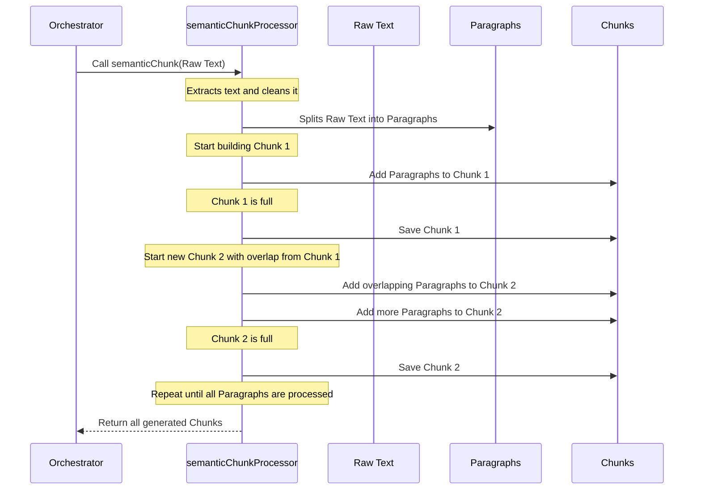

# Chapter 2: Document Ingestion & Semantic Chunking

In [Chapter 1: Agent Orchestrator](01_agent_orchestrator_.md), we learned that the Agent Orchestrator is the project manager that takes a raw PDF and coordinates a team of AI experts to extract information. Before those smart specialist agents can do their work, the document needs to be prepared. Imagine giving a complex textbook to a student and asking them to find specific facts. They'd need to read and understand it. But if you gave them well-organized notes, highlighting key sections, they'd be much faster and more accurate!

This is exactly what **Document Ingestion & Semantic Chunking** does for our AI. It's the crucial first step where we take a bulky PDF, extract its text, clean it up, and then break it down into smart, digestible pieces called "chunks." These chunks are like the well-organized notes that our AI agents can easily understand and process.

## Why Can't We Just Give the Whole PDF to the AI?

You might wonder, "Why not just give the entire PDF text to the AI?" There are a few big reasons:

1.  **AI Brain Limitations (Context Window):** Large Language Models (LLMs), like the Gemini model we use, have a "context window." This is like their short-term memory or how much information they can "see" and process at one time. If you give them a document that's too long, they simply can't read it all or start to forget what was at the beginning.
2.  **Accuracy and Focus:** When an AI model has to deal with a massive amount of text, it can get overwhelmed or lose focus. Breaking it into smaller, more relevant pieces helps the AI concentrate on the specific information needed for a task.
3.  **Cost and Speed:** Processing very long texts is often slower and more expensive with AI models. Smaller chunks are faster and more economical.

So, the problem is: **how do we convert a large, unstructured PDF into small, meaningful, and context-rich pieces that our AI can easily work with?**

## The Solution: Document Ingestion & Semantic Chunking

This process is broken down into two main parts:

### 1. Document Ingestion (Text Extraction & Cleaning)

The very first step is to get the actual text out of the PDF document. A PDF is like a digital printout; its text isn't immediately available as plain, readable words for a computer program.

*   **Extraction:** Our system uses a library called `pdf-parse` to read the PDF and pull out all the raw text.
*   **Cleaning:** Sometimes, during extraction, strange characters (like "null bytes") can appear. These are invisible to us but can confuse an AI model. So, we clean the text by removing them, ensuring a pristine input.

### 2. Semantic Chunking (Smartly Breaking Text Apart)

Once we have clean text, we need to break it into smaller pieces. But we can't just cut it randomly every X number of words! Imagine cutting a book mid-sentence – you'd lose the meaning.

**Semantic Chunking** means breaking the text into pieces that make sense together. We aim to keep related sentences and paragraphs in the same "chunk."

Here's how our semantic chunking strategy works:

*   **Paragraph-Based:** Instead of splitting by exact character counts, we try to split along natural breaks like paragraph endings. This helps keep complete thoughts together.
*   **Target Size:** We aim for chunks of a specific, manageable size (around 3000 characters in our case). This size is chosen to fit comfortably within the AI's context window.
*   **The "Overlap" Feature (Crucial!):** This is the clever part! When one chunk ends, we don't just start the next chunk from scratch. We repeat the last couple of paragraphs from the previous chunk at the *beginning* of the new chunk.

    Why do we do this?
    *   **Context Preservation:** Sometimes, a very important idea or sentence might span across the boundary where we decide to make a cut. With overlap, even if the main part of the idea is in Chunk A, the beginning of it is also carried over to Chunk B.
    *   **Bridge for AI:** It's like building a bridge between two islands of information. If an AI agent only looks at Chunk B, and the crucial piece of information started in Chunk A but concluded in B, the overlap ensures Chunk B still has enough context to understand the full picture.

    Think of it like reading a long story. When you turn a page, you might re-read the last sentence or two from the previous page to make sure you remember exactly what was happening. Our chunks do the same for the AI!

## How the Orchestrator Uses Document Ingestion & Semantic Chunking

In [Chapter 1](01_agent_orchestrator_.md), we saw the `AgentOrchestrator` has a method called `ingestDocument`. This is the method that kicks off our ingestion and chunking process.

Let's revisit the simplified example from Chapter 1 to see where this happens:

```typescript
// app/api/extract/route.ts (Simplified)
import { AgentOrchestrator } from "@/lib/agents/orchestrator";
// ... other imports ...

export async function POST(req: NextRequest) {
    // ... file reception logic ...

    const orchestrator = new AgentOrchestrator();

    // This is where Document Ingestion & Semantic Chunking happens!
    console.log(`Ingesting document: ${fileName}`);
    const ingestResult = await orchestrator.ingestDocument(buffer, fileName);

    console.log(`Executing agents for: ${fileName}`);
    const extractionResults = await orchestrator.executeExtraction(fileName);

    return NextResponse.json({ success: true, extraction: extractionResults });
}
```
**What's Happening Above?**

When you call `orchestrator.ingestDocument(buffer, fileName)`, the Orchestrator takes the raw PDF content (`buffer`) and the `fileName`. It then internally performs all the steps we just discussed: extracting text, cleaning it, and then breaking it into `semantic chunks` with overlap.

**Example Input (Conceptual):**

You provide a PDF file like `my_policy.pdf`.

**Example Output (Conceptual):**

The `ingestDocument` method returns information about the process. Here, it tells us how many chunks were successfully created:

```json
{
  "message": "Ingestion complete",
  "chunksCreated": 25 // For example, the PDF was broken into 25 pieces
}
```
These 25 pieces are now perfectly prepared for our specialist AI agents!

## Behind the Scenes: How `semanticChunk` Works

Let's look at the process inside the `ingestDocument` method, focusing on the `semanticChunk` part.

### Step-by-Step Flow:

1.  **Get Raw Text:** The `ingestDocument` method first extracts all the text from the PDF.
2.  **Split into Paragraphs:** This long text is then broken down into individual paragraphs. This is important because paragraphs are natural units of thought.
3.  **Build Chunks:** The system starts collecting these paragraphs into a `currentChunk`.
4.  **Check Size:** It continuously checks if the `currentChunk` is getting too long (over our target size, e.g., 3000 characters).
5.  **Save & Overlap:** If the `currentChunk` becomes too big, it's saved as a complete chunk. Then, a *new* `currentChunk` is started, but it includes the last few paragraphs from the *previous* chunk as an overlap. This ensures context isn't lost.
6.  **Repeat:** Steps 3-5 repeat until all paragraphs are processed.
7.  **Final Chunks:** All the created chunks are returned.

Here's a simplified diagram of this process:



### The `semanticChunk` Code:

Let's look at the actual method within `lib/agents/orchestrator.ts` that performs this clever chunking:

```typescript
// lib/agents/orchestrator.ts (Simplified)
// ... (inside AgentOrchestrator class) ...

private semanticChunk(text: string): string[] {
    // 1. Break the entire document text into individual paragraphs.
    const paragraphs = text.split(/\n\n+/);
    const chunks: string[] = [];
    let currentChunk = "";
    const overlapCount = 2; // We'll re-use the last 2 paragraphs
    const recentParagraphs: string[] = []; // Stores recent paragraphs for overlap

    // 2. Go through each paragraph to build chunks
    for (const para of paragraphs) {
        const cleanPara = para.trim().replace(/\u0000/g, "");
        if (cleanPara.length === 0) continue; // Skip empty paragraphs

        // 3. Check if adding the next paragraph makes the current chunk too long
        if ((currentChunk.length + cleanPara.length) > 3000 && currentChunk.length > 0) {
            chunks.push(currentChunk.trim()); // Save the current chunk

            // 4. Start a new chunk, adding the overlap from the previous one
            currentChunk = recentParagraphs.slice(-overlapCount).join("\n\n") + "\n\n";
        }
        // 5. Add the current paragraph to the chunk and keep track of it
        currentChunk += cleanPara + "\n\n";
        recentParagraphs.push(cleanPara);

        // Keep recentParagraphs array size limited to 'overlapCount' + a few more for efficiency
        if (recentParagraphs.length > overlapCount + 5) { // e.g., keep last 7 paragraphs
            recentParagraphs.shift(); // Remove the oldest one
        }
    }
    // 6. Add any remaining text as the last chunk
    if (currentChunk.trim().length > 0) chunks.push(currentChunk.trim());
    return chunks;
}
```
**Explanation:**

*   `text.split(/\n\n+/)`: This line takes the entire document text and breaks it into an array of strings, where each string is a paragraph. It splits wherever there are two or more newline characters.
*   `overlapCount = 2`: This tells our system to use the last 2 paragraphs from the previous chunk as the start of the next one.
*   `recentParagraphs`: This array keeps track of the latest paragraphs we've processed, so we can use them for the overlap.
*   `if ((currentChunk.length + cleanPara.length) > 3000 ...)`: This is the main check. If adding the next paragraph (`cleanPara`) would make our `currentChunk` exceed approximately 3000 characters, we do two things:
    *   `chunks.push(currentChunk.trim())`: We save the `currentChunk` as a complete chunk.
    *   `currentChunk = recentParagraphs.slice(-overlapCount).join("\n\n") + "\n\n";`: We then start a `new currentChunk`. This new chunk is *not* empty; it begins with the last two paragraphs (`-overlapCount`) from `recentParagraphs`, separated by newlines. This is our crucial overlap!
*   `currentChunk += cleanPara + "\n\n";`: We add the current paragraph to `currentChunk`.
*   `recentParagraphs.push(cleanPara);`: We add the current paragraph to our `recentParagraphs` list to potentially be used for future overlaps.

## Conclusion

Document Ingestion & Semantic Chunking is the unsung hero of our AI system. It takes the messy, raw PDF document and transforms it into perfectly structured, context-rich chunks that our specialist AI agents can efficiently process. By extracting text, cleaning it, and intelligently breaking it into meaningful, overlapping pieces, we ensure that no critical information is lost and our AI can perform its tasks accurately and efficiently. This preparation is foundational for everything that comes next.

Once these chunks are created, they're not just floating around. They need to be stored in a way that our AI agents can quickly search and retrieve relevant information. That's exactly what we'll explore in the next chapter!

[Next Chapter: Vector Store (Supabase + pgvector)](03_vector_store__supabase___pgvector__.md)

---
