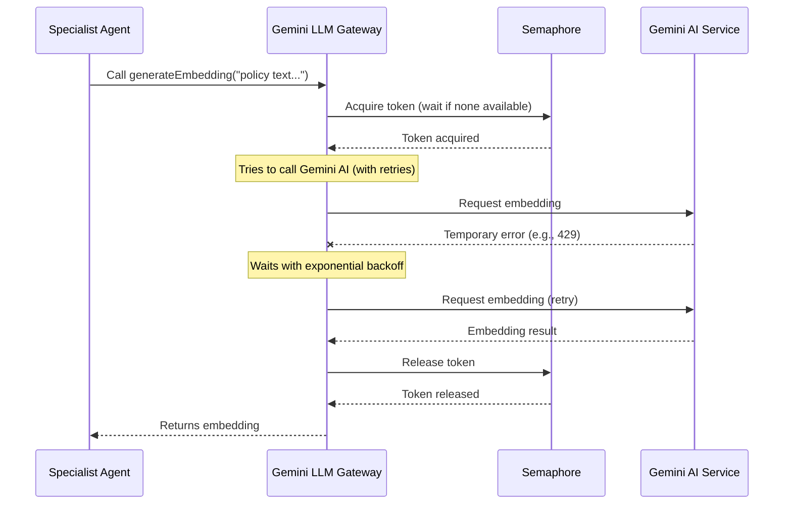

# Chapter 4: Gemini LLM Interaction (with Throttling & Retries)

In [Chapter 3: Vector Store (Supabase + pgvector)](03_vector_store__supabase___pgvector__.md), we learned how our prepared policy document chunks are transformed into "embeddings" (numerical representations of meaning) and stored in a special database for fast, semantic searching. But how are those magical embeddings created? And once our specialist agents find relevant chunks, how do they actually "read" and understand them to provide answers?

This is where the **Gemini LLM Interaction (with Throttling & Retries)** comes in. Think of this as our project's dedicated "AI Communicator." It's the secure and smart way our system talks to Google's powerful Gemini AI model. It makes sure that our conversations with Gemini are always efficient, reliable, and don't overwhelm the AI service.

## What Problem Does Our AI Communicator Solve?

Imagine you have a super-smart friend (Gemini AI) who can answer almost any question. But:
1.  **They are very popular:** Many people (our specialist agents) want to ask them questions at the same time. If everyone shouts at once, your friend gets overwhelmed and might miss some questions!
2.  **Sometimes they get busy:** Even smart friends can have a bad day or be temporarily unavailable. If they don't respond immediately, you shouldn't just give up; you should try again politely after a short break.

This is exactly the challenge when interacting with a powerful AI model like Gemini. Our `primepolicy-ai-main` project needs to:
*   **Send many requests:** Specialist agents need to ask various questions, generate embeddings, or extract structured data.
*   **Handle high traffic:** Multiple agents might need to talk to Gemini simultaneously.
*   **Be resilient to errors:** The internet can be flaky, or the AI service might be temporarily overloaded.

Without a smart way to manage these interactions, our system could crash, get stuck, or simply fail to get the information it needs.

## The Solution: A Managed Gateway to Gemini

Our project uses a special set of tools to interact with Gemini. These tools act as a "managed gateway," providing two crucial features:

### 1. Throttling (Preventing Overwhelm)

*   **Concept:** Imagine a bouncer at a popular club. The club can only safely hold a certain number of people. The bouncer makes sure not too many people enter at once, creating a queue if necessary. This is "throttling."
*   **How it works (Semaphore):** Our system uses a concept called a "semaphore." It's like a limited number of "tokens." Before any part of our system can talk to Gemini, it must "acquire" a token. If all tokens are in use, it waits in line until one becomes free. Once the conversation with Gemini is done, the token is "released" for others to use.
*   **Benefit:** This prevents us from sending too many requests to Gemini at once, which could lead to our requests being rejected or our access being temporarily blocked.

### 2. Retries (Handling Temporary Hiccups)

*   **Concept:** Imagine calling a customer service line, and it's busy. You hang up and call again a minute later. If it's still busy, you wait a bit longer, maybe two minutes, then four, and so on. This is "exponential backoff."
*   **How it works:** If our system tries to talk to Gemini and gets a temporary error (like "service busy" or "too many requests"), it doesn't immediately give up. Instead, it waits for a short period, then tries again. If it fails again, it waits for a *longer* period (the delay "backs off" exponentially). It will keep trying a few times until the request succeeds or a permanent error occurs.
*   **Benefit:** This makes our system much more robust. Temporary network issues or busy AI services won't cause our entire process to fail.

## How Our Project Uses Gemini Interaction

Our specialist agents (which we'll explore in [Chapter 5: Specialist Agents](05_specialist_agents_.md)) primarily use this gateway for two main types of interactions with Gemini:

### 1. Generating Embeddings

As we saw in [Chapter 3: Vector Store (Supabase + pgvector)](03_vector_store__supabase___pgvector__.md), creating numerical embeddings for our document chunks is key. This is done by asking Gemini to convert text into its numerical representation.

**Example Use Case (from `lib/vector-store.ts`):**

```typescript
// lib/vector-store.ts (Simplified)
import { generateEmbedding } from "./gemini"; // Our AI Communicator

export async function addDocumentSections(sections: any[]) {
    // ... loop through document sections ...
    const batchResults = await Promise.all(
        batch.map(async (section) => ({
            ...section,
            // Ask Gemini to create the embedding for the chunk's text
            embedding: await generateEmbedding(section.content),
        }))
    );
    // ... store in vector store ...
}
```
**Explanation:** When we call `generateEmbedding(section.content)`, our AI Communicator handles sending the text to Gemini, waiting for a token (throttling), and retrying if there's a temporary issue. It then returns the list of numbers (the embedding).

### 2. Generating Content & Structured Output

Once an agent has retrieved relevant chunks from the Vector Store, it needs to ask Gemini a specific question or extract information in a structured format (like JSON).

**Example Use Case (conceptual, for a specialist agent):**

```typescript
// lib/agents/eligibility-agent.ts (Conceptual, Simplified)
import { generateStructuredOutput } from "@/lib/gemini"; // Our AI Communicator

public async run(documentId: string): Promise<any> {
    // ... (Agent retrieves relevant chunks from Vector Store) ...
    const relevantText = "Eligibility: age 18-65, must reside in USA.";

    const prompt = `Extract age and residency requirements from: ${relevantText}`;
    const schema = `{ "min_age": number, "max_age": number, "residency": string }`;

    // Ask Gemini to extract structured data, with throttling and retries
    const result = await generateStructuredOutput(prompt, schema);
    
    // Example output (conceptual): { min_age: 18, max_age: 65, residency: "USA" }
    return { status: "success", data: result };
}
```
**Explanation:** Here, `generateStructuredOutput` takes a `prompt` (our specific question for Gemini) and a `schema` (how we want the answer formatted). Our AI Communicator takes care of all the robust interaction details, ensuring Gemini processes the request and returns the structured JSON, even if it has to retry a few times.

## Behind the Scenes: How the AI Communicator Works

Let's peek under the hood of `lib/gemini.ts` to see how throttling and retries are implemented.

### Step-by-Step Flow: An AI Interaction



### Code Walkthrough: `lib/gemini.ts`

Our `lib/gemini.ts` file orchestrates all these interactions.

#### 1. The Bouncer: `Semaphore`

This class manages how many concurrent requests can go out to Gemini.

```typescript
// lib/gemini.ts (Simplified)
class Semaphore {
    private tasks: (() => void)[] = [];
    constructor(private count: number) { } // 'count' is max concurrent calls

    async acquire() {
        if (this.count > 0) {
            this.count--; // Take a token
            return;
        }
        // If no tokens, wait in line for one to become free
        await new Promise<void>(resolve => this.tasks.push(resolve));
    }

    release() {
        if (this.tasks.length > 0) {
            const next = this.tasks.shift(); // Let the next in line proceed
            next?.();
        } else {
            this.count++; // Put a token back for future requests
        }
    }
}

// Our global bouncer, allowing a maximum of 5 concurrent AI calls
const globalThrottle = new Semaphore(5);
```
**Explanation:** The `Semaphore` is initialized with a `count` (e.g., 5). When `acquire()` is called, it either immediately lets the request proceed (by decreasing `count`) or adds the request to a `tasks` queue if `count` is zero. When `release()` is called, it either increments `count` or, if there's a queue, it signals the next waiting task to proceed.

#### 2. The Patient Dialer: `withRetry`

This function wraps any Gemini call and adds the retry logic.

```typescript
// lib/gemini.ts (Simplified)
async function withRetry<T>(fn: () => Promise<T>, maxRetries = 5, baseDelay = 1500): Promise<T> {
    let lastError: any;
    for (let i = 0; i <= maxRetries; i++) {
        try {
            return await fn(); // Try the actual Gemini call
        } catch (error: any) {
            lastError = error;
            // Check if it's a temporary service error (e.g., 429 "Too Many Requests", 503 "Service Unavailable")
            const isServiceError = error.message?.includes("429") || error.message?.includes("503");

            if (!isServiceError || i === maxRetries) {
                break; // Not a temporary error or max retries reached, so give up
            }

            const delay = baseDelay * Math.pow(2, i); // Calculate exponential backoff delay
            // Log for debugging (using our logger, which we'll see in Chapter 7)
            // logger.debug(`[GEMINI] Retrying in ${delay}ms... (Attempt ${i + 1}/${maxRetries})`);
            await new Promise(resolve => setTimeout(resolve, delay)); // Wait for the calculated delay
        }
    }
    throw lastError; // If all retries fail, throw the final error
}
```
**Explanation:** `withRetry` takes a function (`fn`) that makes the actual call to Gemini. It attempts this function up to `maxRetries`. If a temporary error occurs, it calculates a `delay` that gets progressively longer (`baseDelay` doubled for each attempt) and waits before trying again.

#### 3. Communicating with Gemini

Finally, our functions for generating embeddings and content use both the `Semaphore` and `withRetry`.

```typescript
// lib/gemini.ts (Simplified)
import { GoogleGenerativeAI } from "@google/generative-ai";
const genAI = new GoogleGenerativeAI(process.env.GEMINI_API_KEY!); // Connect to Gemini

export async function generateEmbedding(text: string) {
    return withRetry(async () => { // Use the retry logic
        await globalThrottle.acquire(); // Acquire a token from our bouncer
        try {
            const model = genAI.getGenerativeModel({ model: "gemini-embedding-001" });
            const result = await model.embedContent({ content: { role: "user", parts: [{ text }] } });
            return result.embedding.values;
        } finally {
            globalThrottle.release(); // IMPORTANT: Always release the token
        }
    });
}

export async function generateStructuredOutput<T>(prompt: string, schemaDescription: string): Promise<T> {
    return withRetry(async () => { // Use the retry logic
        await globalThrottle.acquire(); // Acquire a token from our bouncer
        try {
            const model = genAI.getGenerativeModel({
                model: "gemini-2.0-flash",
                generationConfig: { responseMimeType: "application/json" }
            });
            const fullPrompt = `${prompt}\n\nYou MUST return the output as a JSON object following this schema:\n${schemaDescription}`;
            const result = await model.generateContent(fullPrompt);
            return JSON.parse(result.response.text()) as T;
        } finally {
            globalThrottle.release(); // IMPORTANT: Always release the token
        }
    });
}
```
**Explanation:** Both `generateEmbedding` and `generateStructuredOutput` follow a similar pattern:
1.  They are wrapped in `withRetry` to handle temporary errors.
2.  Inside the retry function, they first `await globalThrottle.acquire()` to get permission (a token) before making the actual call to the Gemini API (`genAI.getGenerativeModel()...`).
3.  The actual call is inside a `try...finally` block to ensure that `globalThrottle.release()` is *always* called, giving the token back, whether the call succeeded or failed.

## Conclusion

The "Gemini LLM Interaction (with Throttling & Retries)" module is the robust and responsible way our project communicates with Google's powerful Gemini AI. By implementing a "semaphore" for throttling and "exponential backoff" for retries, it ensures that our AI calls are efficient, do not overwhelm the service, and are resilient to temporary errors. This managed gateway is essential for the stability and performance of our entire policy extraction pipeline, allowing our specialist agents to reliably generate embeddings and extract structured information.

Now that we understand how our system talks to Gemini, we're ready to meet the individual AI team members who use this communication channel to do their specialized work.

[Next Chapter: Specialist Agents](05_specialist_agents_.md)

---