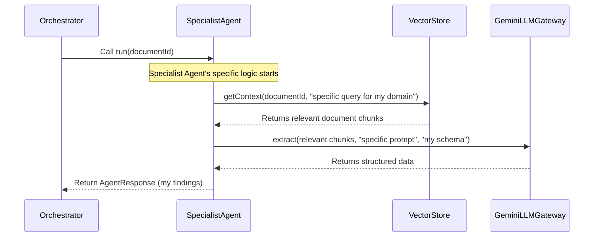

# Chapter 5: Specialist Agents

In [Chapter 4: Gemini LLM Interaction (with Throttling & Retries)](04_gemini_llm_interaction__with_throttling___retries__.md), we explored how our system safely and reliably communicates with the powerful Gemini AI. Now, it's time to meet the actual "workers" who use this communication channel to perform their tasks: the **Specialist Agents**.

Remember from [Chapter 1: Agent Orchestrator](01_agent_orchestrator_.md) that our `AgentOrchestrator` acts like a project manager. But a project manager needs a team of experts to delegate tasks to!

## What Problem Do Specialist Agents Solve?

Imagine you have a huge, complicated insurance policy document. It contains all sorts of information: who can get the policy (eligibility), what benefits it offers, how much it costs, what happens if payments are missed, and so on. If you had to extract *all* of this information manually, it would be a very long and error-prone job for one person.

Now, imagine giving all these complex tasks to *one single AI model*. It would be like asking one person to be an expert in law, medicine, finance, and customer service all at once! This would likely lead to:
*   **Overwhelm**: Too much information for one AI to process accurately.
*   **Lower Accuracy**: The AI might make mistakes trying to cover too many topics.
*   **Difficulty in Management**: If something goes wrong, it's hard to pinpoint why.

The problem is: **How do we efficiently and accurately extract many different types of structured information from a complex document using AI?**

## The Solution: A Team of Experts

Our `primepolicy-ai-main` project solves this by creating a **team of Specialist Agents**. Think of these agents as a group of highly trained experts, where each one has a specific area of focus within an insurance policy.

For example:
*   One agent is an expert on "Eligibility Rules."
*   Another is an expert on "Benefits."
*   A third specializes in "Pricing Structure."

Each agent focuses only on its assigned domain. This approach brings several benefits:

1.  **Specialization**: Each agent becomes very good at extracting specific details, leading to higher accuracy.
2.  **Efficiency**: Agents only look for what's relevant to their domain, making the process faster.
3.  **Modularity**: If a new type of information needs to be extracted, we just add a new specialist agent without affecting others.
4.  **Clarity**: It's easier to understand and debug if an agent focuses on a clear, defined task.

## Key Concepts of Specialist Agents

All specialist agents in our project follow a common blueprint to ensure they work together smoothly.

### 1. `BaseAgent`: The Common Framework

Every specialist agent in our system inherits from a `BaseAgent` class. This `BaseAgent` provides the fundamental tools and methods that all agents need to do their job. It's like giving all your team members a standard laptop, internet access, and a handbook on how to find information.

The `BaseAgent` provides two critical helper methods:

*   **`getContext`**: This method is how an agent queries the [Vector Store (Supabase + pgvector)](03_vector_store__supabase___pgvector__.md) for relevant document sections. This process is known as **Retrieval-Augmented Generation (RAG)**. Instead of trying to "guess" the answer, the agent first "retrieves" the most relevant parts of the policy document.
*   **`extract`**: Once the agent has the relevant document sections, this method interacts with the [Gemini LLM Interaction (with Throttling & Retries)](04_gemini_llm_interaction__with_throttling___retries__.md) to actually extract the specific information. It ensures the extracted data follows a predefined structure, often based on our [Definitive PAS Schema](06_definitive_pas_schema_.md).

### 2. Independent Work, Orchestrated Combination

Each specialist agent works independently on its specific task. They don't directly talk to each other. Instead, their findings are later collected and combined by the [Agent Orchestrator](01_agent_orchestrator_.md) into one complete and structured JSON report.

## How to Use Specialist Agents

As a user or developer interacting with `primepolicy-ai-main`, you primarily interact with the [Agent Orchestrator](01_agent_orchestrator_.md). The Orchestrator is responsible for *managing* and *running* these specialist agents. You don't directly call an individual `EligibilityAgent`, for example.

Let's revisit how the `AgentOrchestrator` uses these agents (from Chapter 1):

```typescript
// lib/agents/orchestrator.ts (Simplified)
import { IdentityAgent } from "./identity-agent";
import { EligibilityAgent } from "./eligibility-agent";
// ... other agent imports ...

export class AgentOrchestrator {
    private agents: BaseAgent[] = [];

    constructor() {
        // The orchestrator knows which expert agents it needs
        this.agents = [
            new IdentityAgent(),      // Finds policy identification details
            new EligibilityAgent(),   // Checks who can be covered by the policy
            // ... many other specialist agents are initialized here ...
        ];
    }

    public async executeExtraction(documentId: string): Promise<any> {
        // ...
        for (let i = 0; i < this.agents.length; i += clusterSize) {
            const cluster = this.agents.slice(i, i + clusterSize);
            // Each agent in the cluster works on its task in parallel
            const clusterResults = await Promise.all(cluster.map(agent => agent.run(documentId)));
            // ... collects results ...
        }
        // ... consolidates data ...
    }
}
```
**What's Happening Above?**

1.  **Team Assembly**: In the `AgentOrchestrator`'s `constructor`, it creates instances of all the specialist agents (e.g., `new IdentityAgent()`, `new EligibilityAgent()`). This is like gathering the team before a project starts.
2.  **Task Assignment**: When `orchestrator.executeExtraction()` is called, it iterates through these agents, calling each agent's `run()` method. It even groups them into "clusters" to manage the workload efficiently.

**Example Input (Conceptual):**

The Orchestrator tells an agent, "Here's the document ID (`my_policy.pdf`), go extract your specific information."

**Example Output (Conceptual):**

Each specialist agent returns its findings in a structured way. For example, an `EligibilityAgent` might return:

```json
{
  "agentName": "Eligibility Agent",
  "data": {
    "eligibility": {
      "entry_age_min": 18,
      "entry_age_max": 65,
      "maturity_age_max": 80,
      "minimum_sum_assured": 100000,
      "maximum_sum_assured": 5000000,
      "policy_term_min_years": 5,
      "policy_term_max_years": 40
    }
  },
  "status": "success"
}
```
Notice how this agent only focused on "eligibility" details, not benefits or pricing. The Orchestrator will then merge this with findings from other agents.

## Behind the Scenes: How Specialist Agents Work Internally

Let's look at the common structure and workflow of a specialist agent.

### Step-by-Step Flow for a Single Specialist Agent



### Code Walkthrough: `lib/agents/base.ts` (The Blueprint)

This file defines the `BaseAgent` class, which all our specialist agents extend.

```typescript
// lib/agents/base.ts (Simplified)
import { generateStructuredOutput } from "../gemini";
import { searchDocumentSections } from "../vector-store";
import { logger } from "../utils";

export interface AgentResponse {
    agentName: string;
    data: any;
    status: "success" | "error";
    message?: string;
}

export abstract class BaseAgent {
    public abstract name: string;
    public abstract description: string;

    public abstract run(documentId: string): Promise<AgentResponse>;

    protected async getContext(documentId: string, query: string, limit = 5) {
        logger.debug(`[${this.name}] Getting context for: ${query}...`);
        const results = await searchDocumentSections(query, limit, 0.5, documentId);
        return results.map(r => r.content).join("\n\n---\n\n");
    }

    protected async extract<T>(context: string, prompt: string, schema: string): Promise<T> {
        const fullPrompt = `CONTEXT: ${context}\n\nTASK: ${prompt}`;
        logger.debug(`[${this.name}] Starting extraction for: ${prompt.substring(0, 50)}...`);
        const result = await generateStructuredOutput<T>(fullPrompt, schema);
        logger.debug(`[${this.name}] Extraction complete`);
        return result;
    }
}
```
**Explanation:**
1.  **`AgentResponse`**: This defines the standard format in which every agent must return its results (agent name, data, status, and an optional message).
2.  **`abstract class BaseAgent`**: This is the blueprint.
    *   `name` and `description` are properties every agent *must* have.
    *   `run(documentId: string)` is an abstract method, meaning every agent *must* implement its own specific `run` logic. This is where the agent's unique expertise comes into play.
3.  **`getContext` Method**: This is a common helper that all agents use.
    *   It takes a `documentId` (the name of the policy document), and a `query` (what information the agent is looking for).
    *   It calls `searchDocumentSections` from our [Vector Store](03_vector_store__supabase___pgvector__.md) to find the most relevant document chunks based on the `query`.
    *   It then combines these relevant chunks into a single `context` string, which is then passed to the LLM.
4.  **`extract` Method**: This is another common helper.
    *   It takes the `context` (the relevant chunks found by `getContext`), a `prompt` (the specific instruction for the LLM), and a `schema` (the JSON structure the LLM should follow).
    *   It calls `generateStructuredOutput` from our [Gemini LLM Interaction](04_gemini_llm_interaction__with_throttling___retries__.md) module. This sends the prompt and schema to Gemini and gets back a nicely structured JSON response.

### Code Walkthrough: An Example Specialist Agent (`lib/agents/eligibility-agent.ts`)

Now, let's see how a specific agent, the `EligibilityAgent`, puts the `BaseAgent` framework to use.

```typescript
// lib/agents/eligibility-agent.ts
import { BaseAgent, AgentResponse } from "./base";
import { DEFINITIVE_PAS_SCHEMA } from "./schema"; // Our master schema

export class EligibilityAgent extends BaseAgent {
    public name = "Eligibility Agent";
    public description = "Owner of eligibility domain.";

    public async run(documentId: string): Promise<AgentResponse> {
        try {
            // 1. Get relevant context for eligibility rules
            const context = await this.getContext(
                documentId,
                "Extract entry age bounds, maturity age bounds, financial sum assured limits, and policy term constraints."
            );

            // 2. Define the specific prompt for Gemini
            const prompt = `Extract entry ages, maturity ages, financial limits (SA bounds), and policy term constraints.
      - entry_age_min: minimum entry age.
      // ... (other fields omitted for brevity) ...
      Ensure all numerical outputs are pure numbers. Use null if not available. Strictly follow the DEFINITIVE_PAS_SCHEMA.eligibility structure.`;

            // 3. Define the expected output schema (part of our master schema)
            const schema = JSON.stringify({ eligibility: DEFINITIVE_PAS_SCHEMA.eligibility }, null, 2);

            // 4. Use the base agent's extract method to get structured data
            const data = await this.extract<any>(context, prompt, schema);

            return {
                agentName: this.name,
                data,
                status: "success",
            };
        } catch (error: any) {
            return { agentName: this.name, data: null, status: "error", message: error.message };
        }
    }
}
```
**Explanation:**
1.  **Extends `BaseAgent`**: `EligibilityAgent` builds upon `BaseAgent`, automatically getting `getContext` and `extract` methods.
2.  **`name` and `description`**: It provides its unique name and description.
3.  **`run` Method**: This is where the magic happens for *this specific agent*:
    *   It calls `this.getContext()` with a `query` specifically crafted to find eligibility information (e.g., "entry age bounds," "maturity age").
    *   It then prepares a detailed `prompt` for Gemini, telling it exactly what to look for within the retrieved `context`.
    *   It specifies a `schema` using `DEFINITIVE_PAS_SCHEMA.eligibility`. This tells Gemini *how* to format the extracted eligibility data (e.g., `entry_age_min` should be a number). We'll learn more about this schema in [Chapter 6: Definitive PAS Schema](06_definitive_pas_schema_.md).
    *   Finally, it calls `this.extract()` to send all this to Gemini and get back the structured eligibility data.
    *   It returns the data in the standard `AgentResponse` format.

This pattern is repeated for every specialist agent, whether it's the `PricingAgent`, `BenefitLogicAgent`, or `ExclusionAgent`. Each one is an expert in its little corner of the policy document!

## Our Team of Specialist Agents

Here are some of the specialist agents currently on our team:

| Agent Name         | Description                                                    | Specialization Domain                 |
| :----------------- | :------------------------------------------------------------- | :------------------------------------ |
| Identity Agent     | Extracts product name, family, variant, jurisdiction, currency. | `product_context`                     |
| Eligibility Agent  | Focuses on entry ages, maturity ages, sum assured limits.      | `eligibility`                         |
| Benefit Logic Agent| Maps benefit types, descriptions, payout formulas.             | `benefits`                            |
| Pricing Agent      | Extracts premium structure, payment frequencies, grace periods.| `premium_structure`                   |
| Exclusion Agent    | Identifies policy exclusions and their applicable periods.     | `exclusions`                          |
| Lifecycle Agent    | Covers lapse conditions, revival periods, surrender, loans, bonuses. | `policy_lifecycle`, `bonuses`     |
| Compliance Agent   | Extracts tax benefits and regulatory notes.                    | `tax_and_regulatory`                  |

## Conclusion

Specialist Agents are the dedicated workforce of our `primepolicy-ai-main` project. By breaking down the complex task of policy extraction into smaller, domain-specific problems, they bring focus, accuracy, and scalability to our system. Each agent, leveraging the common `BaseAgent` framework, efficiently retrieves relevant information from the [Vector Store](03_vector_store__supabase___pgvector__.md) and intelligently extracts structured data using the [Gemini LLM](04_gemini_llm_interaction__with_throttling___retries__.md), all while adhering to a shared output structure.

Now that we understand who the team members are and how they operate, the next logical step is to explore the precise format of the final report they are all contributing to. This is where the master plan, our [Definitive PAS Schema](06_definitive_pas_schema_.md), comes into play.

[Next Chapter: Definitive PAS Schema](06_definitive_pas_schema_.md)

---