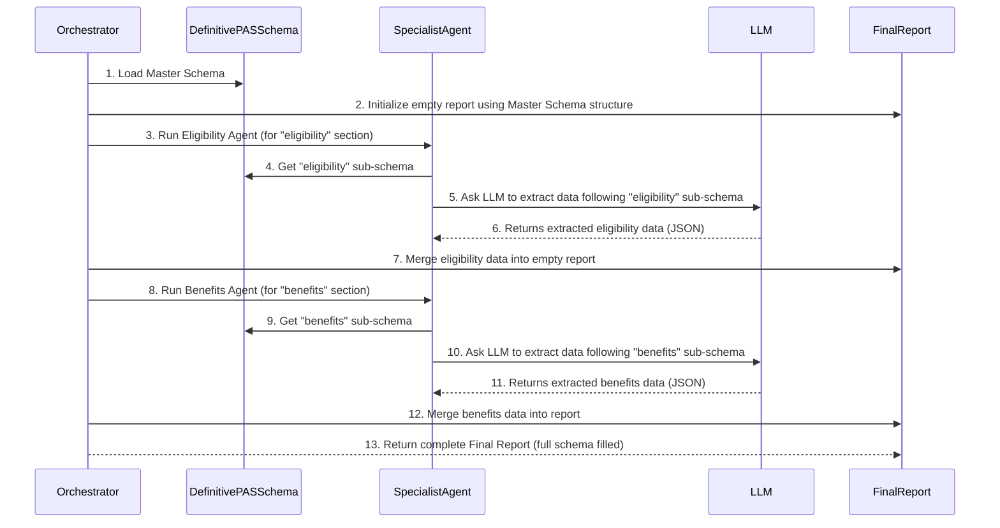

# Chapter 6: Definitive PAS Schema

In [Chapter 5: Specialist Agents](05_specialist_agents_.md), we learned about our team of expert AI agents, each specializing in extracting different types of information from an insurance policy document. Each agent works diligently to find specific details, like eligibility rules or benefit descriptions. But imagine if each agent decided to return their findings in their own unique way – one might use "minAge", another "minimum_age", and a third just "ageRange". How would we combine all these different pieces into one coherent, easy-to-understand report? It would be a messy puzzle!

This is exactly the problem the **Definitive PAS Schema** solves. Think of it as the ultimate blueprint or a master contract that all specialist agents agree to follow. It defines exactly what information should be extracted and precisely how that information should be structured and named.

## What Problem Does the Definitive PAS Schema Solve?

Our main goal is to transform a complex, unstructured PDF policy document into a perfectly organized, machine-readable JSON report that other computer systems (like a real Policy Administration System, or PAS) can easily use.

The challenge is: **How do we ensure that all the diverse pieces of information extracted by different specialist agents are consistent, predictable, and immediately usable by other systems, regardless of how they appeared in the original document?**

Without a definitive schema, the output might look like a jumbled collection of facts. With it, we get a beautifully structured and standardized report.

## The Solution: A Master Blueprint

The Definitive PAS Schema is precisely that master blueprint. It's a strict JSON structure that acts as a universal language for all extracted policy data within our `primepolicy-ai-main` project.

Let's break down its key aspects:

### 1. What is a Schema?

In simple terms, a schema is like a detailed form or a set of rules that defines the structure and type of data.
*   **Analogy:** Imagine you're filling out an official government form. The form tells you exactly what information to provide (e.g., "First Name," "Date of Birth"), what type of information it should be (e.g., text, numbers, a date format), and sometimes even how long it should be. The schema is that form for our data.

### 2. Why "Definitive PAS Schema"?

*   **Definitive:** This means it's the *final*, *official*, and *unambiguous* structure. There's no room for interpretation or variations. Every piece of information extracted must fit into this exact blueprint.
*   **PAS (Policy Administration System):** This signifies that the structure is designed to be directly compatible with real-world insurance policy administration systems. It's built for practical use, not just for our internal AI processing.

### 3. Strict JSON Structure

Our schema uses a strict JSON (JavaScript Object Notation) format. JSON is a very popular, human-readable, and machine-friendly way to represent structured data. It defines:
*   **Keys:** The names of the data fields (e.g., `product_name`, `entry_age_min`).
*   **Data Types:** What kind of value each field expects (e.g., `string`, `number`, `boolean`, `array`).
*   **Nesting:** How fields are grouped into objects (e.g., `eligibility` containing `entry_age_min` and `entry_age_max`).

By having this clear, standardized structure, our system ensures that the extracted data is consistent, predictable, and directly usable by other systems, no matter the original document's format or wording.

## How the Project Uses the Definitive PAS Schema

The Definitive PAS Schema plays a crucial role at several points in our extraction pipeline:

1.  **Orchestrator's Master Plan:** The [Agent Orchestrator](01_agent_orchestrator_.md) uses this schema as the blank canvas or initial template for the final report. It creates an empty JSON object that exactly matches the schema's structure.
2.  **Agent's Target:** Each [Specialist Agent](05_specialist_agents_.md) is designed to extract information for a *specific part* of this schema. When an agent extracts data, it aims to fill its designated section of the master schema.
3.  **LLM's Guide:** When a specialist agent asks the Gemini LLM (via [Chapter 4: Gemini LLM Interaction](04_gemini_llm_interaction__with_throttling___retries__.md)) to extract structured data, it provides the relevant *sub-section* of the Definitive PAS Schema. This tells the LLM exactly how to format its output.

### Example Use Case: Combining Agent Findings

Imagine the `EligibilityAgent` finds the minimum and maximum entry ages, and the `BenefitLogicAgent` finds details about a "death benefit." Without a schema, these might just be two separate data blobs. With the schema, they fit perfectly into their predefined spots.

**Example Input (Conceptual):**

The Orchestrator starts with a general instruction: "Extract all policy details for `my_policy.pdf`."

**Example Output (Conceptual):**

After the Orchestrator has run all the specialist agents and merged their findings according to the schema, you get a single, coherent JSON report:

```json
{
  "product_context": {
    "product_name": "Health Shield Plan",
    "product_family": "HEALTH",
    "variant_code": "PLUS-001",
    "line_of_business": "Individual Health Insurance",
    "jurisdiction": {
      "country_code": "US",
      "regulator": "State Insurance Department"
    },
    "currency": "USD"
  },
  "eligibility": {
    "entry_age_min": 18,
    "entry_age_max": 65,
    "maturity_age_max": 80,
    "minimum_sum_assured": 10000,
    "maximum_sum_assured": 500000,
    "policy_term_min_years": 1,
    "policy_term_max_years": 50
  },
  "benefits": [
    {
      "benefit_type": "death",
      "description": "Lump sum payout upon policyholder's death.",
      "payout_formula": "100% of Sum Assured",
      "waiting_period": "90 days"
    }
  ]
  // ... more structured data following the schema ...
}
```
Notice how every piece of information has a clear name and a predictable structure. This JSON is now ready for any automated system to consume!

## Behind the Scenes: How the Schema is Used

Let's look at how the Definitive PAS Schema (defined in `lib/agents/schema.ts`) is put into action.

### Step-by-Step Flow: Schema-Guided Extraction



### Code Walkthrough: `lib/agents/schema.ts` (The Blueprint Definition)

This file is where our master plan, the `DEFINITIVE_PAS_SCHEMA`, is defined.

```typescript
// lib/agents/schema.ts (Simplified)
export const DEFINITIVE_PAS_SCHEMA = {
    "product_context": {
        "product_name": "string",
        "product_family": "TERM | ENDOWMENT | ULIP | ANNUITY | HEALTH",
        "variant_code": "string | null",
        // ... more product context fields ...
    },

    "eligibility": {
        "entry_age_min": "number",
        "entry_age_max": "number",
        // ... more eligibility fields ...
    },

    "benefits": [ // This is an array, as a policy can have multiple benefits
        {
            "benefit_type": "death | maturity | survival | disability | critical_illness",
            "description": "string",
            "payout_formula": "string",
            "waiting_period": "string | null"
        }
    ],
    // ... other top-level schema sections like premium_structure, exclusions, etc. ...
};

export const SCHEMA_STRING = JSON.stringify(DEFINITIVE_PAS_SCHEMA, null, 2);
```
**Explanation:**
*   `DEFINITIVE_PAS_SCHEMA`: This JavaScript object *is* our master blueprint. It defines the names of all the top-level sections (`product_context`, `eligibility`, `benefits`) and what kind of data should be inside them.
*   "string", "number", "boolean": These indicate the expected data type for each field.
*   `"TERM | ENDOWMENT | ..."`: For `product_family`, this indicates a set of allowed values (an enum).
*   `"string | null"`: This means the field can be a string, or it can be `null` if the information isn't found.
*   `"benefits": [...]`: The square brackets indicate that `benefits` is an *array* of objects, because a policy can have many different benefits. Each object in the array follows the structure defined within the brackets.
*   `SCHEMA_STRING`: This is just a string version of the schema, useful when sending it to the LLM.

### Code Walkthrough: `lib/agents/orchestrator.ts` (Using the Blueprint)

The `AgentOrchestrator` uses the `DEFINITIVE_PAS_SCHEMA` to initialize the final report structure.

```typescript
// lib/agents/orchestrator.ts (Simplified)
import { DEFINITIVE_PAS_SCHEMA } from "./schema"; // Import our master blueprint

export class AgentOrchestrator {
    // ... (constructor and ingestDocument methods) ...

    public async executeExtraction(documentId: string): Promise<any> {
        // ... (agents are run, and results are collected in 'results' array) ...

        // 1. Initialize the consolidated data with the structure of our master schema
        //    We use JSON.parse(JSON.stringify(...)) to create a deep copy,
        //    so we don't accidentally modify the original schema definition.
        const consolidatedData: any = JSON.parse(JSON.stringify(DEFINITIVE_PAS_SCHEMA));

        // 2. Loop through all the findings from different specialist agents
        results.forEach(res => {
            if (res.status === "success" && res.data) {
                // 3. Smartly merge each agent's data into the consolidated report.
                //    This ensures data goes into the correct, predefined places.
                this.deepMerge(consolidatedData, res.data);
            }
        });

        return consolidatedData; // The final, fully structured report!
    }

    // ... (deepMerge and semanticChunk methods) ...
}
```
**Explanation:**
1.  **`import { DEFINITIVE_PAS_SCHEMA } from "./schema";`**: We first bring in our schema definition.
2.  **`const consolidatedData: any = JSON.parse(JSON.stringify(DEFINITIVE_PAS_SCHEMA));`**: This line is crucial. It creates an empty JSON object (`consolidatedData`) that *exactly matches the structure* of our `DEFINITIVE_PAS_SCHEMA`. It's like preparing an empty form based on the master template.
3.  **`this.deepMerge(consolidatedData, res.data);`**: As each specialist agent returns its findings (`res.data`), the Orchestrator uses the `deepMerge` function to combine that data into `consolidatedData`. Since agents are instructed to produce data that fits the schema, `deepMerge` will correctly place, for example, `eligibility` details into the `eligibility` section of the `consolidatedData` object.

### Code Walkthrough: `lib/agents/base.ts` (Agents Using Sub-Schemas)

Specialist agents leverage the schema by using specific parts of it as a guide for the LLM.

```typescript
// lib/agents/base.ts (Simplified)
import { generateStructuredOutput } from "../gemini";
// ... other imports ...

export abstract class BaseAgent {
    // ... (name, description, run, getContext methods) ...

    /**
     * Helper to perform extraction from context using a defined schema.
     */
    protected async extract<T>(context: string, prompt: string, schema: string): Promise<T> {
        const fullPrompt = `
      CONTEXT:
      ${context}

      TASK:
      ${prompt}
    `;

        // The 'schema' argument here is a sub-section of the Definitive PAS Schema.
        // It tells the LLM the exact JSON structure to follow for this specific extraction.
        const result = await generateStructuredOutput<T>(fullPrompt, schema);
        return result;
    }
}
```
**Explanation:**
*   The `extract` method (used by all specialist agents) takes a `schema` string as an argument.
*   This `schema` argument is *not* always the entire `DEFINITIVE_PAS_SCHEMA`. Instead, each specialist agent provides only the *relevant sub-section* of the master schema that pertains to its specific task. For example, an `EligibilityAgent` would pass `JSON.stringify(DEFINITIVE_PAS_SCHEMA.eligibility)` to this `extract` method. This efficiently guides the LLM to produce output in the correct format for *that specific part* of the policy.

## Conclusion

The Definitive PAS Schema is the cornerstone of data consistency and usability in our `primepolicy-ai-main` project. By providing a strict, standardized JSON blueprint, it ensures that all information extracted from complex policy documents by various specialist agents is perfectly organized, predictable, and ready for direct integration into other policy administration systems. It's the master plan that brings all the individual efforts of our AI agents together into one coherent, valuable report.

Now that we understand how information is structured and delivered, the next chapter will introduce a crucial utility that helps us monitor and understand everything happening behind the scenes: our Logger.

[Next Chapter: Logger Utility](07_logger_utility_.md)

---