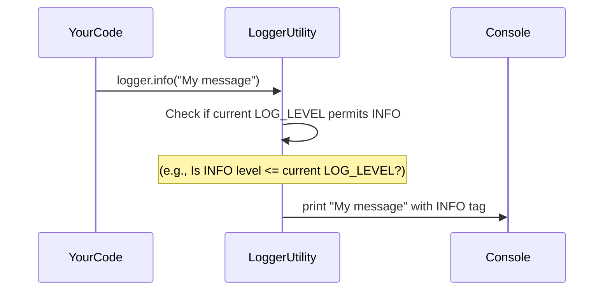

# Chapter 7: Logger Utility

In [Chapter 6: Definitive PAS Schema](06_definitive_pas_schema_.md), we learned how our project creates a perfectly structured JSON report. That's great for the output, but what about everything that happens *during* the extraction process? As our [Agent Orchestrator](01_agent_orchestrator_.md) coordinates [Specialist Agents](05_specialist_agents_.md), interacts with the [Gemini LLM](04_gemini_llm_interaction__with_throttling___retries__.md), and manages the [Vector Store](03_vector_store__supabase___pgvector__.md), there's a lot going on behind the scenes!

Imagine you're trying to figure out why a car isn't starting. If the car just says "Error," that's not very helpful. But if it tells you "Low Fuel," "Battery Dead," or "Engine Overheating," you know exactly where to look!

This is the problem the **Logger Utility** solves for our project. It's like the car's diagnostic system, providing clear and controlled feedback about what the system is doing, without overwhelming you with too much information.

## What Problem Does Our Logger Solve?

When a complex system like `primepolicy-ai-main` is running, it performs many operations:
*   Ingesting documents.
*   Creating chunks.
*   Generating embeddings.
*   Calling AI models.
*   Merging results.

If every single one of these actions printed a message to your terminal, it would quickly become a chaotic mess, impossible to read or understand. On the other hand, if the system was completely silent, you wouldn't know if it's working correctly or if something went wrong.

The problem is: **How do we get just the right amount of information about the system's internal workings – enough to monitor its health and troubleshoot issues, but not so much that it becomes unreadable?**

## The Solution: A Smart Communication Channel with Levels

Our project uses a dedicated **Logger Utility** that acts as the system's communication channel. It’s designed to provide precise feedback by categorizing messages into different **levels**. This allows developers to filter what they see, much like tuning a radio to hear only specific types of broadcasts.

Here's how it makes our lives easier:

1.  **Different "Levels" of Importance**: Messages are not all equal. Some are very important (like errors), while others are only relevant for deep debugging.
2.  **Reduced Clutter**: By default, it prioritizes important "INFO" messages and hides detailed "DEBUG" logs. This significantly cleans up your terminal output.
3.  **Easy Troubleshooting**: When you *do* have a problem, you can easily switch the logger to show more detailed messages, helping you pinpoint the issue quickly.
4.  **Clear Identification**: Messages are often color-coded, making it visually easy to spot different types of feedback (e.g., red for errors, yellow for warnings).

## Key Concepts of the Logger Utility

Let's understand the different "levels" that our logger uses:

| Log Level | Description                                                                                             | When to Use It                                                    | Example                                                                          |
| :-------- | :------------------------------------------------------------------------------------------------------ | :---------------------------------------------------------------- | :------------------------------------------------------------------------------- |
| `DEBUG`   | Very detailed information, useful only for developers who are trying to find bugs or understand flow.   | During development or deep troubleshooting.                       | "Executing agent cluster: Identity Agent, Eligibility Agent"                     |
| `INFO`    | General progress and significant events that show the system is working as expected.                    | Normal operation, production logs.                                | "Ingestion complete: 25 chunks created for my_policy.pdf"                        |
| `WARN`    | Something unexpected happened, but the system can probably recover or continue operating.                | Non-critical issues, potential problems that need attention.      | "PDF might be corrupted, extracted text is very short."                          |
| `ERROR`   | A critical problem occurred that prevents a part of the system from functioning correctly.              | When a process fails, a critical dependency is missing.           | "Gemini failed after retries: API key invalid"                                   |

By default, our system is set to `INFO` level. This means you will see `INFO`, `WARN`, and `ERROR` messages, but `DEBUG` messages will be hidden.

## How to Use the Logger Utility

Using the logger is incredibly simple! You just import the `logger` object and call its methods corresponding to the log level you want.

First, you'll import it:

```typescript
// Any file where you want to log something
import { logger } from "@/lib/utils";
// ...
```
**Explanation:** This line brings our `logger` object into your file, ready to be used. The `logger` object is a single, shared instance throughout the entire application.

Now, let's see how you'd use it in action. Imagine a scenario where the [Agent Orchestrator](01_agent_orchestrator_.md) has finished ingesting a document. It should tell us about it!

```typescript
// lib/agents/orchestrator.ts (Simplified)
import { logger } from "../utils"; // Import our logger

// ... inside AgentOrchestrator class ...

public async ingestDocument(buffer: Buffer, fileName: string) {
    // ... (PDF parsing, text cleaning, semantic chunking) ...
    
    // Use the logger to report successful ingestion!
    logger.info(`Ingestion complete: ${chunks.length} chunks created for ${fileName}`);
    return { message: "Ingestion complete", chunksCreated: chunks.length };
}

public async executeExtraction(documentId: string): Promise<any> {
    logger.info(`[ORCHESTRATOR] Starting definitive PAS extraction for: ${documentId}`);
    // ... (rest of the extraction logic) ...
}
```
**Example Output (Conceptual, in your terminal):**

If your `LOG_LEVEL` is set to `INFO` (the default), you would see:

```
[INFO] Ingestion complete: 25 chunks created for my_policy.pdf
[INFO] [ORCHESTRATOR] Starting definitive PAS extraction for: my_policy.pdf
```
Notice how the messages are color-coded (often green for INFO) and clearly indicate their level.

What if you wanted to see more detailed messages, like which agent cluster is currently running? That would be a `DEBUG` level message.

```typescript
// lib/agents/orchestrator.ts (Simplified)
import { logger } from "../utils"; // Import our logger

// ... inside AgentOrchestrator class ...

public async executeExtraction(documentId: string): Promise<any> {
    logger.info(`[ORCHESTRATOR] Starting definitive PAS extraction for: ${documentId}`);
    const clusterSize = 2;
    for (let i = 0; i < this.agents.length; i += clusterSize) {
        const cluster = this.agents.slice(i, i + clusterSize);
        // This is a DEBUG message, normally hidden!
        logger.debug(`[ORCHESTRATOR] Executing agent cluster: ${cluster.map(a => a.name).join(", ")}`);
        // ...
    }
    // ...
}
```

To see `DEBUG` messages, you would typically set an environment variable before running your application:

```bash
# In your terminal before starting the app
export LOG_LEVEL=0 # 0 corresponds to DEBUG

# Then run your application
npm run dev
```

Now, your terminal output would include the `DEBUG` message:

```
[INFO] Ingestion complete: 25 chunks created for my_policy.pdf
[INFO] [ORCHESTRATOR] Starting definitive PAS extraction for: my_policy.pdf
[DEBUG] [ORCHESTRATOR] Executing agent cluster: Identity Agent, Eligibility Agent
[DEBUG] [ORCHESTRATOR] Executing agent cluster: Benefit Logic Agent, Pricing Agent
# ... and so on ...
```
This ability to dynamically change the verbosity of logs is extremely powerful for development and debugging without making the normal operation logs overly noisy.

## Behind the Scenes: How the Logger Works Internally

Let's look at the simple mechanism that powers our Logger Utility.

### Step-by-Step Flow: Logging a Message



### Code Walkthrough: `lib/utils.ts` (The Logger Definition)

This is where our `Logger` class and its `LogLevel` definitions live.

```typescript
// lib/utils.ts (Simplified)

// Define our log levels as numbers
export enum LogLevel {
  DEBUG = 0,
  INFO = 1,
  WARN = 2,
  ERROR = 3,
}

class Logger {
  // Read the desired log level from an environment variable.
  // If not set, default to INFO.
  private level: LogLevel = (process.env.LOG_LEVEL as any) || LogLevel.INFO;

  // Method for DEBUG messages
  debug(message: string, ...args: any[]) {
    // Only print if the current logger level allows DEBUG messages
    if (this.level <= LogLevel.DEBUG) {
      console.log(`[\x1b[34mDEBUG\x1b[0m] ${message}`, ...args);
    }
  }

  // Method for INFO messages
  info(message: string, ...args: any[]) {
    // Only print if the current logger level allows INFO messages
    if (this.level <= LogLevel.INFO) {
      console.log(`[\x1b[32mINFO\x1b[0m] ${message}`, ...args);
    }
  }

  // Method for WARN messages
  warn(message: string, ...args: any[]) {
    if (this.level <= LogLevel.WARN) {
      console.warn(`[\x1b[33mWARN\x1b[0m] ${message}`, ...args);
    }
  }

  // Method for ERROR messages
  error(message: string, ...args: any[]) {
    if (this.level <= LogLevel.ERROR) {
      console.error(`[\x1b[31mERROR\x1b[0m] ${message}`, ...args);
    }
  }
}

// Create a single, shared instance of our Logger
export const logger = new Logger();
```
**Explanation:**
1.  **`LogLevel` Enum**: This defines our log levels (DEBUG, INFO, WARN, ERROR) as numerical values. Lower numbers mean higher verbosity (DEBUG=0 is the most detailed).
2.  **`private level: LogLevel`**: When the `Logger` is created, it checks `process.env.LOG_LEVEL`. If you set `LOG_LEVEL=0` (DEBUG), then `this.level` will be `0`. If you don't set it, it defaults to `1` (INFO).
3.  **`debug`, `info`, `warn`, `error` Methods**: Each method does two key things:
    *   **Level Check**: `if (this.level <= LogLevel.X)`: This is the filter! If `this.level` is `INFO` (`1`), then `logger.debug()` (where `LogLevel.DEBUG` is `0`) will NOT pass the check (`1 <= 0` is false), so `DEBUG` messages are hidden. But `logger.info()` (`1 <= 1` is true) WILL pass, so `INFO` messages are shown. This logic ensures that setting a level (e.g., `INFO`) will show all messages at that level *and higher importance* (WARN, ERROR).
    *   **Console Output**: If the check passes, it uses `console.log`, `console.warn`, or `console.error` to print the message. The `\x1b[34m` parts are **ANSI escape codes** that add colors to the terminal output, making the logs easier to read visually.
4.  **`export const logger = new Logger();`**: This creates *one single instance* of our `Logger` class and makes it available to be imported and used anywhere in our project. This is a common pattern for utility objects.

### Code Walkthrough: `lib/gemini.ts` (Logger in Action)

The logger is used throughout the project to provide insights into complex operations, such as handling retries with the [Gemini LLM](04_gemini_llm_interaction__with_throttling___retries__.md).

```typescript
// lib/gemini.ts (Simplified)
import { logger } from "./utils"; // Import our logger

// ... Semaphore and withRetry classes ...

async function withRetry<T>(fn: () => Promise<T>, maxRetries = 5, baseDelay = 1500): Promise<T> {
    let lastError: any;
    for (let i = 0; i <= maxRetries; i++) {
        try {
            return await fn();
        } catch (error: any) {
            lastError = error;
            // ... (error type checking) ...

            const delay = baseDelay * Math.pow(2, i);
            // Here, we use logger.debug to show retry attempts.
            // This will only be visible if LOG_LEVEL is set to DEBUG (0).
            logger.debug(`[GEMINI] Transient error: ${error.message}. Retrying in ${delay}ms... (Attempt ${i + 1}/${maxRetries})`);
            await new Promise(resolve => setTimeout(resolve, delay));
        }
    }
    throw lastError;
}
// ... rest of the gemini interactions ...
```
**Explanation:** In the `withRetry` function, which handles temporary errors when talking to Gemini, we use `logger.debug` to report each retry attempt. This provides very granular detail about the communication process. Because it's `DEBUG` level, these messages are hidden during normal operation but become invaluable when troubleshooting connection issues or API rate limits.

## Conclusion

The Logger Utility is our system's dedicated voice, designed to provide clear and controlled feedback without overwhelming the user. By supporting different message levels (DEBUG, INFO, WARN, ERROR) and prioritizing important messages by default, it effectively reduces terminal clutter while ensuring that critical information is always visible. This makes monitoring the system's operation and quickly identifying problems when troubleshooting much easier and more efficient.

You've now completed the entire journey through the core components of `primepolicy-ai-main`! From orchestrating agents to ingesting documents, managing vector stores, interacting with LLMs, defining schemas, and finally, monitoring it all with a logger, you have a solid understanding of how this powerful policy extraction system works.

---