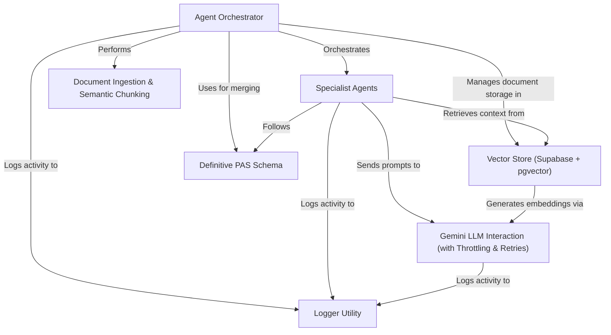

# Tutorial: primepolicy-ai-main

This project is an *AI-powered system* designed to extract key information from **insurance policy PDF documents**. It intelligently reads, understands, and converts complex policy details into a *structured JSON format*, making it easier for other policy administration systems to use this data.

## Visual Overview

## Chapters

1. [Agent Orchestrator
](01_agent_orchestrator_.md)
2. [Document Ingestion & Semantic Chunking
](02_document_ingestion___semantic_chunking_.md)
3. [Vector Store (Supabase + pgvector)
](03_vector_store__supabase___pgvector__.md)
4. [Gemini LLM Interaction (with Throttling & Retries)
](04_gemini_llm_interaction__with_throttling___retries__.md)
5. [Specialist Agents
](05_specialist_agents_.md)
6. [Definitive PAS Schema
](06_definitive_pas_schema_.md)
7. [Logger Utility
](07_logger_utility_.md)

---