# Flow of the PrimePolicy AI System

This document outlines the complete flow of the document extraction pipeline, from the moment a PDF is uploaded to the final JSON output.

### START
The process begins when a user uploads a PDF document to the system for analysis. The document contains complex policy information that needs to be broken down and structured.

---

### PHASE 1: Document Ingestion & Preparation
This phase focuses on reading the PDF and converting it into a searchable format.

* **PDF Parsing**: The `AgentOrchestrator` receives the PDF file (buffer and file name) and uses the `pdf-parse` library to extract raw text from it.
* **Cleaning Data**: Unnecessary null characters are removed to prepare a clean text string. `clearDocumentSections` in `vector-store.ts` removes old records.
* **Semantic Chunking**: The orchestrator's `semanticChunk()` method breaks the massive text into smaller readable pieces (chunks) of about 3000 characters. It keeps an overlap of a couple paragraphs to ensure no context is lost between splits.
* **Generating Embeddings**: For each chunk, the system uses `gemini.ts` to call `generateEmbedding()`. 
  * *What is an embedding?* An embedding is simply a way to convert human text into an array of numbers (vectors). The AI uses these numbers to understand the "meaning" of the text mathematically, making it easier to search for related concepts later.
* **Vector Store Storage**: The chunks and their numerical embeddings are sent to `vector-store.ts`. The `addDocumentSections()` function saves them into the `document_sections` table in a Supabase database.
  * *What is a vector store?* It is a specialized database that stores these number arrays (embeddings) and can quickly find pieces of text that have similar meanings (via a similarity query).

---

### PHASE 2: Intelligence & Extraction
This phase applies AI "agents" to extract meaningful data from the vector store.

* **Starting Orchestration**: The `AgentOrchestrator` triggers `executeExtraction(documentId)`.
* **Agent Clusters**: To avoid hitting rate limits and overloading the system, the orchestrator groups the 11 domain agents (e.g., `IdentityAgent`, `EligibilityAgent`, `PricingAgent`, `UnderwritingAgent`, etc.) into smaller clusters of 2 (`clusterSize = 2`) and runs them concurrently.
* **BaseAgent Operations**: Every domain agent inherits from the `BaseAgent` parent class. It triggers its individual `.run(documentId)` function.
* **Getting Context**: 
  * Each domain agent determines what policy detail it needs to look for.
  * It calls the `getContext()` method defined in `BaseAgent`.
  * `getContext()` uses `vector-store.ts` (`searchDocumentSections()`) to perform a vector search, finding the most relevant textual chunks in the Supabase database that match the agent's query.
* **AI Extraction**: Once the relevant subset of text is found, the agent calls `extract()` in the `BaseAgent` class.
* **Gemini LLM Processing**: 
  * The `extract()` method calls `generateStructuredOutput()` inside `gemini.ts`.
  * It combines the found text (context with the prompt limit), task instructions (prompt), and schema constraints, then passes it to the Gemini AI using a JSON-enforced structure.
  * The `gemini.ts` system handles potential errors, rate limits, or transient API glitches using `withRetry` (exponential backoff) and paces requests using a `globalThrottle` lock.
  * The Gemini model reliably returns a constructed JSON block for that exact domain.

---

### PHASE 3: Consolidation & Output
The final step brings all the puzzle pieces together tightly.

* **Merging Results**: The `AgentOrchestrator` gathers all the returning AgentResponses (which carry `status: "success"` and the extracted `data`) from all agents once they finish.
* **Using the Template**: It uses `DEFINITIVE_PAS_SCHEMA` as a blank master blueprint to guarantee the shape of the final JSON output.
* **Deep Merge**: The orchestrator executes `deepMerge()` to stitch and inject all the individually extracted JSON pieces from the domain agents deep inside the master `DEFINITIVE_PAS_SCHEMA` template object.
* **Final JSON File**: The combined, fully structured data is returned to the user as the final JSON output, fully representing the policy content in a structured logic tree.

---

### Summary Table of Key Components

| Component / File | Description & Job |
|---|---|
| **AgentOrchestrator** | (`orchestrator.ts`) The central coordinator that handles the PDF ingestion, orchestrates chunking, manages the clustered execution flow of all 11 agents, and merges the responses into a final JSON. |
| **pdf-parse** | A dependency library used during ingestion to extract raw textual data out of the uploaded PDF file. |
| **Supabase & Postgres** | The relational database where the extracted document chunks and their arrays (embeddings) are preserved inside the custom `document_sections` table. |
| **vector-store.ts** | The database connection bridge. It handles saving new chunks with embeddings (`addDocumentSections`) and querying relevant chunks using algorithmic similarity searches (`searchDocumentSections`). |
| **gemini.ts** | The Gemini API service wrapper. It holds responsibilities for generating vector numbers (`generateEmbedding`), building targeted JSON objects (`generateStructuredOutput`), and safely managing network concurrency locks/retries (`globalThrottle` & `withRetry`). |
| **BaseAgent** | (`base.ts`) The abstract parent class offering standardized methods to all active agents. It dictates how to retrieve information (`getContext`) and request AI extraction (`extract`). |
| **11 Domain Agents** | (e.g., `UnderwritingAgent`, `PricingAgent`) Specialized child agents that extend `BaseAgent`. Each has a unique mandate and isolated prompt to find, extract, and format a distinct slice of the document policy. |
| **DEFINITIVE_PAS_SCHEMA** | (`schema.ts`) The master JSON shell/typing structure acting as the final blueprint. All extracted agent responses map and compile into this singular object shape. |

---

### Complete Process Flowchart

```mermaid
graph TD
    %% START
    Start([User Uploads PDF]) --> Orchestrator_Ingest[AgentOrchestrator<br/>ingestDocument / PDF Ingestion]

    %% PHASE 1: Ingestion
    subgraph Phase 1: Document Ingestion & Preparation
        Orchestrator_Ingest --> PDFParse[Lib: pdf-parse<br/>Extract Raw Text]
        PDFParse --> CleanText[Clean Text<br/>Remove null chars]
        CleanText --> Chunking[AgentOrchestrator<br/>semanticChunk: Split into overlapping 3000-char chunks]
        Chunking --> GetEmbeddings[gemini.ts<br/>generateEmbedding: Convert chunks to vectors]
        GetEmbeddings --> VectorStore[vector-store.ts<br/>addDocumentSections: Save chunks & embeddings to Supabase]
    end

    VectorStore --> Orchestrator_Extract[AgentOrchestrator<br/>executeExtraction starts]

    %% PHASE 2: Intelligence & Extraction
    subgraph Phase 2: Intelligence & Extraction
        Orchestrator_Extract --> Clusters[Distribute 11 Domain Agents in Clusters of 2<br/>to avoid rate limits]
        
        Clusters --> AgentRun[DomainAgent runs BaseAgent's run method]
        AgentRun --> GetContext[BaseAgent: getContext]
        
        GetContext --> SearchVector[vector-store.ts<br/>searchDocumentSections: Fetch relevant chunks from Supabase]
        SearchVector --> Extract[BaseAgent: extract]
        
        Extract --> GeminiOutput[gemini.ts<br/>generateStructuredOutput: Call Gemini-2.0-flash with Context, Prompt, Schema]
        GeminiOutput --> RetryThrottle[gemini.ts<br/>withRetry & globalThrottle: Handle network/API limits]
        RetryThrottle --> AgentReturn[Agent Returns Extracted JSON Segment]
    end

    AgentReturn --> Merging[AgentOrchestrator: gather AgentResponses]

    %% PHASE 3: Consolidation
    subgraph Phase 3: Consolidation & Output
        Merging --> DeepMerge[AgentOrchestrator<br/>deepMerge: Stitch JSON segments together]
        DeepMerge --> SchemaDef[Apply over DEFINITIVE_PAS_SCHEMA<br/>Ensure exact final format]
        SchemaDef --> FinalJSON([Output Final Complete JSON Object])
    end
```

